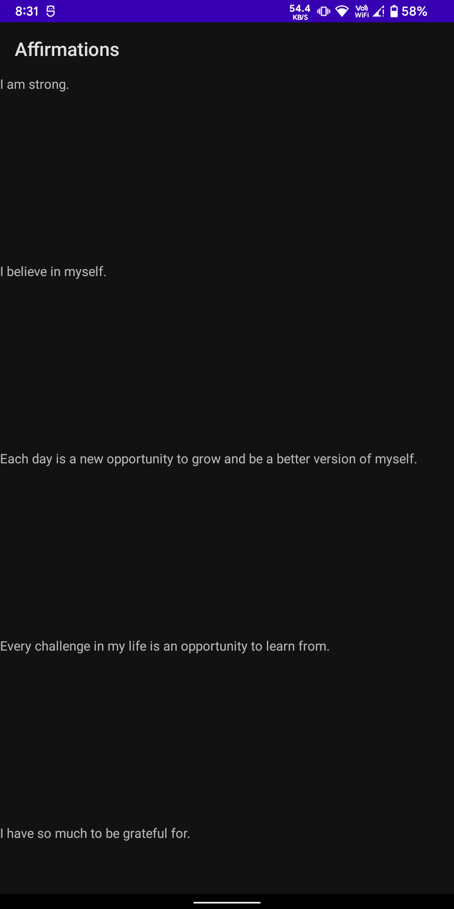
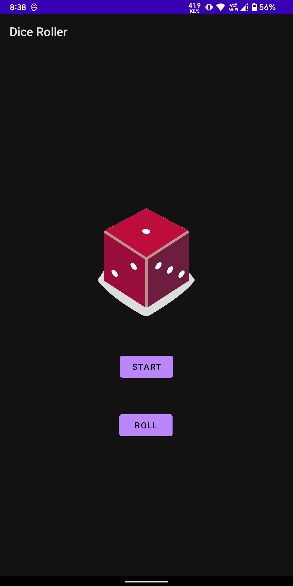
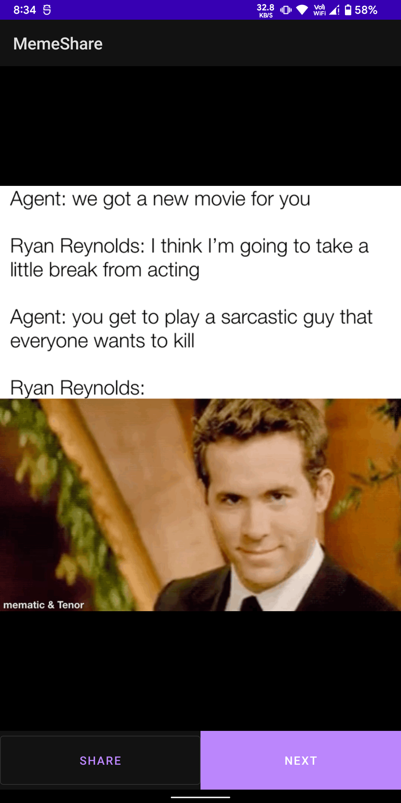
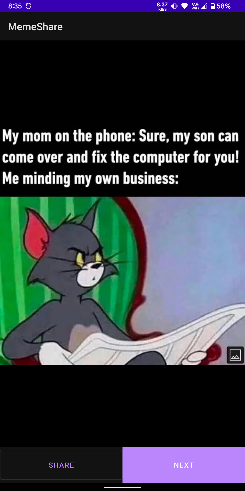
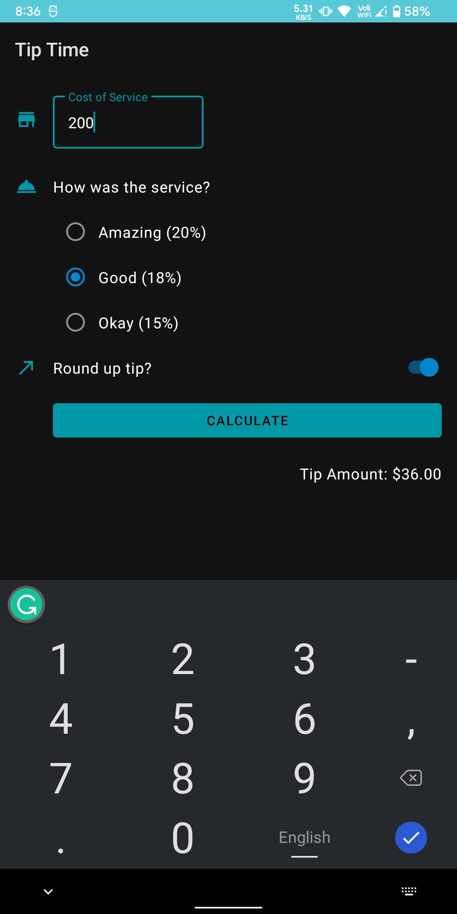
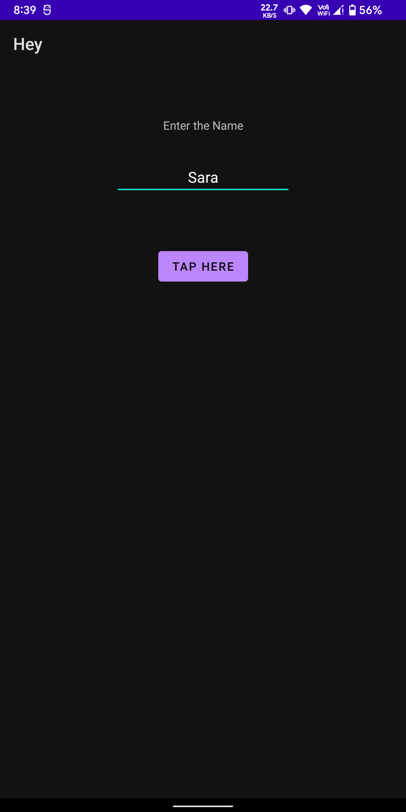
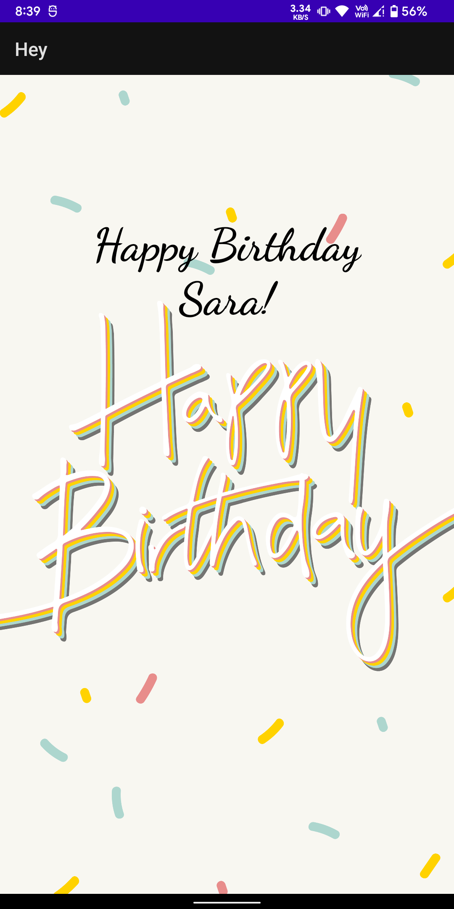

# Projects
Some basic apps which were made for learning and understanding purpose.

1. Affirmation: Application of RecyclerView.
2. DiceRoller: Simple DiceRoller app with cool drawables.
3. Hey: Intent implementation App
4. MemeShare: Application of API.
4. TipTime: Application of Material Design.

## Screenshots

<table>
  <tr>
     <td align="center">Affirmation</td>
     <td colspan="2" align="center">DiceRoller</td>

  </tr>
  <tr>
    <td valign="center"></td>
    <td valign="center"></td>
    <td valign="center"></td>
  </tr>
  
  <tr>
    <td colspan="2" align="center">MemeShare</td>
    <td align="center">TipTime</td>
  </tr>
  
  <tr>
    <td valign="center"></td>
    <td valign="center"></td>
    <td valign="center"></td>
  </tr>
  
  <tr>
    <td colspan="3" align="center">Hey</td>
  </tr>
  
  <tr>
    <td valign="center"></td>
    <td valign="center"></td>
    <td valign="center"></td>
  </tr>
 </table>
  
