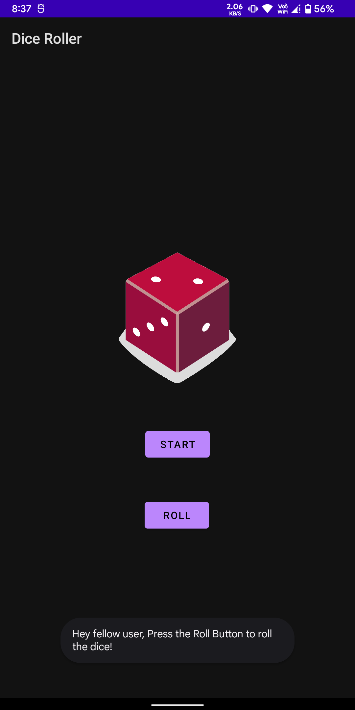

# Projects
Some basic apps which were made for learning and understanding purpose.

1. Affirmation: This app was made to understand and implement RecyclerView.
2. DiceRoller: Simple DiceRoller app with cool drawables.
3. Hey: This app was made to understand how to use Intent in Android.
4. MemeShare: Basic  implementation to understand Volley networking library and Glide image loader library in android.
4. TipTime: This app was made to explore material design and themes in android.

## Screenshots

<table>
  <tr>
     <td align="center">Affirmation</td>
     <td align="center">DiceRoller Start</td>
     <td align="center">DiceRoller</td>

  </tr>
  <tr>
    <td valign="center"></td>
    <td valign="center"></td>
    <td valign="center"></td>
  </tr>
  
  <tr>
    <td colspan="2" align="center">MemeShare</td>
    <td align="center">TipTime</td>
  </tr>
  
  <tr>
    <td valign="center"></td>
    <td valign="center"></td>
    <td valign="center"></td>
  </tr>
  
  <tr>
    <td align="center">Hey Start</td>
    <td align="center">Hey Sara</td>
    <td align="center">Hey Joe</td>
  </tr>
  
  <tr>
    <td valign="center"></td>
    <td valign="center"></td>
    <td valign="center"></td>
  </tr>
 </table>
  
